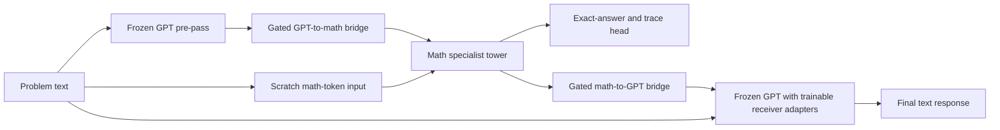

# CFTN-Text: Generalist and Mathematical Specialist

## Project purpose

CFTN-Text transfers the brain-inspired CFTN idea from language-and-vision to
two language-processing towers:

- a pretrained general-language GPT tower;
- a small mathematical tower trained from scratch to become extremely reliable
  on a deliberately narrow family of mathematics problems;
- a trainable, bidirectional corpus callosum that lets the towers exchange
  intermediate representations;
- a text output produced after the two towers have collaborated.

The first research question is intentionally modest and measurable:

> Can a frozen general-language model and a scratch-trained mathematical
> specialist solve held-out mathematical language problems better by exchanging
> compact bidirectional messages than either tower alone or a conventional
> parameter-matched connection?

This is not intended to be a mixture-of-experts model. Both towers remain active
on every example and retain stable roles. The gates control communication
between the towers; they never choose which tower runs.

## Why this is a better first test of the CFTN idea

Image generation introduced several confounded problems at once: visual
tokenization, reconstruction, generative-prior quality, semantic conditioning,
and perceptual evaluation. Narrow mathematics removes most of those variables.
It provides:

- unlimited deterministic training data;
- exact, automatically checkable answers;
- executable intermediate solution steps;
- clean train, validation, and test separation;
- adjustable difficulty and compositional depth;
- inexpensive generation and evaluation;
- direct ablations of each communication direction.

An unsuccessful result will therefore be interpretable. It cannot be blamed on
an inadequate image renderer or a subjective quality metric.

## Core hypothesis

The two towers should develop complementary roles:

- **GPT tower:** interprets natural language, paraphrases, intent, and response
  style.
- **Math tower:** represents numbers, operators, equation state, and executable
  solution procedures precisely.
- **GPT-to-math bridge:** provides semantic and linguistic context to the math
  tower.
- **Math-to-GPT bridge:** provides the computed answer and structured solution
  state to GPT.

The desired behavior is collaboration, not delegation. GPT should help the
specialist interpret unfamiliar wording, while the specialist should make GPT's
answer mathematically reliable.

## V1 problem domain

Start with one-variable integer affine equations. Every generated problem is a
linguistic or symbolic representation of:

```text
a*x + b = c
```

The generator chooses nonzero `a`, an integer solution `x`, and an integer `b`,
then computes `c = a*x + b`. This construction guarantees a unique integer
solution and avoids ambiguous labels.

Examples:

```text
Solve 7*x + 4 = 53.

Seven times a number, increased by four, is fifty-three. Find the number.

After adding 4 to 7 times an unknown value, the result is 53. What is the
unknown value?
```

Canonical machine-verifiable target:

```text
<work>SUB 4; 7*x=49; DIV 7; x=7</work><answer>7</answer>
```

The primary metric is the parsed integer inside `<answer>`. Natural-language
explanation quality is secondary and must never replace exact execution.

After V1 passes, expand in controlled stages:

1. expressions with `+`, `-`, multiplication, and parentheses;
2. equations with the variable on both sides;
3. two-variable systems with guaranteed integer solutions;
4. short word problems that compose two or three known operations.

Do not mix these extensions into the first experiment. A narrow pass is more
useful than an uninterpretable broad failure.

## Dataset contract

Generate the data locally from a versioned deterministic generator. No external
math dataset is required for V1.

### Recommended initial size

- Frozen-GPT calibration: 5,000 unique problems, never used for training.
- Training: 100,000 unique problems.
- In-distribution validation: 10,000 unique problems.
- In-distribution test: 10,000 unique problems.
- Held-out-language test: 10,000 problems using unseen wording templates.
- Numerical-extrapolation test: 10,000 problems outside the training ranges.
- Compositional challenge test: 10,000 rearranged or structurally harder forms.

These are text records and should occupy little disk space. If training has not
converged, create more unique training records rather than repeating a tiny
set indefinitely.

### Initial ranges

For training and in-distribution evaluation:

```text
a: -20..20, excluding 0
x: -50..50
b: -100..100
c: computed exactly
```

For numerical extrapolation:

```text
abs(a): 21..50
abs(x): 51..200
abs(b): 101..500
```

Keep all intermediate values within a configured safe bound. Store integers as
strings and calculate labels with integer arithmetic, never floating point.

### Split rules

1. Normalize every problem to an abstract syntax tree containing `(a, b, c, x,
   form_id)`.
2. Hash the normalized record before rendering its wording.
3. Assign immutable train, validation, and test membership from that hash.
4. Reserve at least 20% of language templates exclusively for the held-out-
   language test.
5. Keep extrapolation ranges disjoint by construction.
6. Reject duplicate normalized equations within and across splits.
7. Save the generator version, seed, split hashes, and final manifests.
8. Never select checkpoints or tune thresholds using any test split.

The calibration split is evaluated before any trainable model is fitted. It is
used only to measure how much of the task frozen GPT already solves and to
decide whether the benchmark needs to be made harder. Its normalized equations
are excluded from training, validation, and all sealed test splits.

Create symbolic and natural-language renderings in balanced proportions. The
math tower receives a lossless character/symbol encoding of the original
problem, while GPT receives its normal tokenizer representation. Neither tower
receives the hidden normalized equation or target answer as an input.

## Model architecture



### General-language tower

Use the project's existing pretrained GPT-2 checkpoint initially.

- Keep all original GPT parameters frozen.
- Run a first pass to obtain contextual language states for the GPT-to-math
  bridge.
- Add zero-initialized receiver adapters to selected upper GPT blocks for the
  math-to-GPT messages.
- When the bridge is disabled, GPT logits must be bit-for-bit identical to the
  original frozen model.
- Do not silently fine-tune embeddings, layer normalization, positional
  embeddings, or the language-model head.

The final GPT receiver pass conditions generation on the original problem plus
the math-to-GPT messages. The base model remains a general language tower;
mathematical specialization is not stored in its frozen weights.

### Mathematical specialist tower

Recommended V1 starting point:

- decoder or prefix-causal Transformer;
- 8 layers;
- hidden size 384;
- 6 attention heads;
- feed-forward size 1,536;
- maximum sequence length 256;
- character/symbol tokenizer with explicit digit, sign, operator, variable,
  delimiter, and text-byte tokens;
- approximately 15-25 million trainable parameters, depending on tokenizer and
  output heads.

The character/symbol representation preserves exact digits and operators. The
tower should predict both the canonical executable trace and final answer. Its
hidden sequence is also the source for the math-to-GPT bridge.

Do not make the tower larger until a small fixed-set capacity test shows that
the current model genuinely lacks capacity. Optimization or data bugs must not
be treated as parameter shortages.

### Corpus-callosum bridges

Use two independent directional bridges:

```text
c_gm = CrossAttend(Q_message, H_gpt)
g_send_gm = sigmoid(SenderGate_gm(c_gm, Pool(H_gpt)))
m_gm = g_send_gm * Project_gm(c_gm)
g_recv_gm = sigmoid(ReceiverGate_gm(H_math, Pool(m_gm)))
H_math' = H_math + g_recv_gm * Receive_gm(H_math, m_gm)

c_mg = CrossAttend(Q_message, H_math)
g_send_mg = sigmoid(SenderGate_mg(c_mg, Pool(H_math)))
m_mg = g_send_mg * Project_mg(c_mg)
g_recv_mg = sigmoid(ReceiverGate_mg(H_gpt, Pool(m_mg)))
H_gpt' = H_gpt + g_recv_mg * Receive_mg(H_gpt, m_mg)
```

These are dynamic context gates, calculated independently for every problem,
message token, receiving layer, and direction. They are not static learned
scalars. They are also not softmax-normalized, do not compete, do not sum to
one, and never decide whether either tower executes. Closing a gate suppresses
only that contextual residual; both towers continue processing the problem.

Recommended initial communication budget per direction:

- 8 learned message queries;
- message width 256;
- gated residual injection;
- zero-initialized output projection;
- GPT-to-math injection at two middle/upper math layers;
- math-to-GPT injection at three upper GPT layers.

The bridge bottleneck is deliberate. It should transmit a compact problem or
solution representation rather than copy every source token. Log gate values,
message norms, and attention entropy, but do not impose arbitrary gate patterns
as a success condition.

## Why this is not mixture of experts

The implementation must preserve all of the following distinctions:

| CFTN-Text | Mixture of experts |
|---|---|
| Both towers run for every problem | A router commonly selects a subset of experts |
| Towers have persistent generalist and mathematical roles | Experts are usually interchangeable processing blocks |
| Gates modulate cross-tower messages | Router weights determine where tokens are processed |
| Towers exchange intermediate states in both directions | Expert outputs are usually aggregated in one direction |
| No top-k routing or load-balancing loss | Sparse top-k routing and load balancing are common |
| Final output follows an explicit collaboration cycle | Output is normally a weighted expert combination |

Hard implementation rules:

1. There must be no task router, expert-selection logits, top-k expert choice,
   or load-balancing objective.
2. Every batch must execute both towers, verified by test counters.
3. A gate may scale only a cross-tower residual or message channel. It may not
   turn tower execution on or off.
4. The final output cannot be an average or vote over independent tower logits.
5. Each direction must have an independent disable and shuffle control.

## Training curriculum

### Stage -1: frozen-GPT task calibration

Before the capacity test or math-tower training, run frozen GPT on all 5,000
calibration problems. Report zero-shot greedy generation, a fixed few-shot
prompt, and conditional-likelihood ranking of the true answer against plausible
distractors. Score strict tagged answers and lenient generated integers, broken
down by template, symbolic versus verbal wording, coefficient signs, and
empirical difficulty.

If frozen GPT reaches 80% exact accuracy by any honest generation protocol, or
if there is less than 20 percentage points of plausible headroom, revise the
task before training the specialist. Do not ask GPT to rate itself; all scoring
comes from the deterministic equation solver.

### Stage 0: contracts and tiny capacity test

Before full training:

- generate and audit all immutable split manifests;
- test the equation generator by executing every target trace;
- verify tokenizer round trips for negative and multi-digit integers;
- enforce the 256-token maximum before model execution;
- overfit 128 examples with the math tower to at least 99.99% answer accuracy;
- overfit the full bridge path on the same 128 examples;
- verify that shuffled bridge messages destroy paired accuracy;
- verify exact frozen-GPT logits when communication is disabled.

Failure here is a wiring, objective, or capacity problem. Do not start the large
run until these tests pass.

### Stage 1: train the math tower independently

Train the specialist from scratch on symbolic and rendered-language problems.
Supervise:

- trace token cross-entropy;
- final-answer token cross-entropy;
- an auxiliary signed-integer answer head;
- optional step-validity loss based on the executable trace.

Select the checkpoint by in-distribution validation exact-answer accuracy, with
trace validity as a tie-breaker. Keep the extrapolation and test sets sealed.

Initial schedule:

- maximum 100 epochs over the fixed 100K training manifest;
- minimum 10 epochs before early stopping;
- early-stop patience of 10 validation checks;
- BF16 mixed precision on supported GPUs;
- gradient clipping at 1.0;
- warmup followed by cosine decay, with a nonzero learning-rate floor;
- retain the latest three checkpoints plus best validation checkpoint.

First tune batch size from a short GPU memory probe. Do not assume an image-model
batch configuration is appropriate for this text model.

### Stage 2: train math-to-GPT communication

Freeze both completed towers. Train only:

- the math-to-GPT bridge;
- GPT receiver adapters that are formally part of the bridge endpoint;
- bridge normalization and gates.

The target GPT response should initially be concise and canonical:

```text
<answer>7</answer>
```

Add fluent explanation targets only after exact answer generation is reliable.
This stage tests whether the specialist can communicate a computed result into
the frozen generalist.

### Stage 3: add GPT-to-math communication

Enable the GPT-to-math bridge and train it primarily on natural-language
renderings. Continue to keep GPT frozen. Initially keep the math tower frozen;
if the bridge plateaus, allow only its top two layers to update at one tenth of
the bridge learning rate.

This direction passes only if it improves held-out-language performance, not
merely training-template accuracy.

### Stage 4: matched end-to-end comparison

Compare the following arms with identical data order, optimization steps,
message width, trainable parameter budget, and checkpoint-selection rule:

1. frozen GPT with a parameter-matched GPT-only adapter;
2. standalone math tower;
3. one-way math-to-GPT bridge;
4. fixed-open bidirectional cross-attention;
5. learned-gate bidirectional CFTN-Text.

Use one development seed while fixing architecture and debugging. Run three
locked replication seeds only after the candidate passes the preregistered
validation gates. Repeating failed seeds is not a substitute for changing a
failed design.

## Required controls

Every validation and final report must include:

- correct paired messages;
- messages shuffled within the batch;
- zeroed GPT-to-math messages;
- zeroed math-to-GPT messages;
- both directions disabled;
- math tower alone;
- frozen GPT alone;
- matched fixed-open cross-attention;
- trainable-parameter counts and actual tower execution counts.

Use the same problem, decoding method, and random seed for correct, shuffled,
and disabled conditions. A high score that survives message shuffling is not
evidence of meaningful bridge communication.

### Complementary-view causal benchmark

The ordinary V1 record is intentionally evaluated, but it is insufficient by
itself to prove collaboration because both towers receive the complete problem.
A sufficiently capable specialist could solve that input alone and leave no
headroom for inter-tower synergy.

The causal benchmark therefore adds a second, immutable view of sealed source
records. For each example:

- GPT receives the algebraic roles of three opaque slots but none of their
  numeric values;
- the math tower receives the numeric values assigned to those slots but not
  which slot is the coefficient, offset, or result;
- all six role permutations are selected deterministically across examples;
- the target remains the exact solution of the original affine equation;
- neither private view contains enough information to determine the answer.

For every selected sealed equation, create an adjacent counterfactual that
changes the result slot by an exact multiple of the coefficient. This changes
the target integer while keeping GPT's role-only input identical. Swapping the
math-to-GPT messages within such a pair should make the final answer follow the
donor problem; swapping the identical GPT-to-math messages within that pair is
an invariance control. General message shuffling must occur across different
pairs so the role permutation is actually corrupted.

This benchmark is a controlled information intervention, not a claim that
normal user prompts will be split this way. Final reporting must include both:

1. shared full-prompt performance for practical utility;
2. complementary-view performance for causal collaboration evidence.

The initial causal gate requires at least a 10-point gain over the stronger
individual tower, a paired 95% confidence interval above zero, measurable gains
from each communication direction, a correct-versus-shuffled gap, and at least
90% counterfactual pair accuracy. The stricter architecture claim still
requires contextual gates to beat a separately trained fixed-open arm by at
least two points with a paired confidence interval above zero.

## Metrics

Primary metrics:

- final integer exact-answer accuracy;
- valid-answer rate;
- executable-trace accuracy;
- per-step mathematical validity;
- held-out-template accuracy;
- numerical-extrapolation accuracy;
- compositional-challenge accuracy.

Communication metrics:

- correct-minus-shuffled accuracy gap;
- correct-minus-disabled accuracy gap for each direction;
- gate value by problem difficulty and wording type;
- message cosine similarity for paired versus shuffled examples;
- answer change rate when only the specialist message changes.

Efficiency metrics:

- total and trainable parameters;
- peak VRAM;
- training tokens per second;
- median and p95 generation latency;
- checkpoint size.

Report greedy unconstrained GPT generation as the main result. A constrained
numeric decoder may be reported separately, but it must not replace the main
metric or conceal malformed generations.

## Preregistered success criteria

### Specialist gate

- at least 99.9% in-distribution validation exact-answer accuracy;
- 100% syntactically valid answers;
- at least 99% executable-trace validity;
- at least 95% numerical-extrapolation accuracy.

### Collaboration gate

- at least 99.5% final in-distribution exact-answer accuracy;
- at least 98% held-out-language accuracy;
- at least 95% numerical-extrapolation accuracy;
- correct paired communication exceeds shuffled communication by at least 20
  percentage points on examples where GPT alone is incorrect;
- disabling math-to-GPT measurably reduces final-answer accuracy;
- disabling GPT-to-math measurably reduces held-out-language accuracy;
- no train/test normalized-equation overlap;
- frozen GPT behavior remains exactly unchanged when bridges are disabled.

### Architecture claim gate

To claim an advantage for the corpus-callosum design, learned-gate CFTN-Text
must beat the strongest parameter-matched conventional baseline on the sealed
test set. Require both:

- an absolute improvement of at least 2 percentage points on the selected OOD
  aggregate; and
- a paired bootstrap 95% confidence interval for the improvement that excludes
  zero.

If the specialist succeeds but the learned gates do not beat fixed-open
cross-attention, the math model is still useful, but the special CFTN
architecture hypothesis has not passed.

## What a successful result would and would not prove

A pass would show that compact, bidirectional communication between a frozen
general-language model and a narrow algorithmic specialist can improve exact
held-out problem solving under controlled conditions.

It would not yet show:

- general mathematical reasoning;
- superiority to large frontier language models;
- transfer to vision or other sensory towers;
- human-like cognition;
- an advantage outside the tested task distribution.

Those claims require later experiments. The purpose of V1 is to establish one
clean and reproducible instance of useful inter-tower communication.

## Proposed repository layout

```text
G:/ctfn-text/
  guide.md
  README.md
  config/
    v1_linear_equations.yaml
  data/
    manifests/
  cftn_text/
    data_generator.py
    tokenizer.py
    math_tower.py
    bridges.py
    gpt_receiver.py
    model.py
    losses.py
    metrics.py
  tools/
    prepare_data.py
    train_math_tower.py
    train_bridges.py
    run_experiment.py
    evaluate.py
    generate.py
  tests/
    test_generator.py
    test_split_integrity.py
    test_tokenizer.py
    test_disabled_invariance.py
    test_shuffle_controls.py
    test_checkpoint_resume.py
  artifacts/
    status.json
    reports/
```

Large checkpoints may be placed in a separate artifact directory, but every
report must record their absolute paths and SHA-256 hashes.

## Suggested configuration skeleton

```yaml
project:
  name: cftn_text_v1_linear_equations
  development_seed: 719
  final_replication_seeds: [719, 1201, 2027]

data:
  train_examples: 100000
  validation_examples: 10000
  test_examples: 10000
  heldout_template_examples: 10000
  extrapolation_examples: 10000
  max_sequence_length: 256

gpt:
  model: gpt2
  frozen: true

math_tower:
  layers: 8
  hidden_size: 384
  attention_heads: 6
  feed_forward_size: 1536
  max_sequence_length: 256

bridge:
  message_tokens: 8
  message_width: 256
  gated: true
  zero_init_output: true

training:
  precision: bf16
  max_epochs: 100
  early_stop_patience: 10
  keep_latest_checkpoints: 3
  gradient_clip: 1.0

monitoring:
  status_interval_minutes: 30
  detailed_report_every_epochs: 10
```

The values are starting points, not hidden success criteria. Record any change
before looking at sealed test results.

## Operational discipline

- Write progress to a compact `status.json` and append-only `metrics.jsonl`.
- Poll long training runs no more often than every 30 minutes unless a process
  stops or errors.
- Report completed epoch, learning rate, train/validation loss, exact accuracy,
  trace validity, shuffled gap, GPU memory, and estimated time remaining.
- Keep the latest three resumable checkpoints and the best validation
  checkpoint; remove obsolete large checkpoints only after their replacement is
  verified.
- Resume from explicit optimizer, scheduler, scaler, RNG, and data-order state.
- Never continue training merely because the maximum epoch has not been reached;
  continue only while the immutable validation objective is improving.
- Never inspect the sealed test set during architecture selection.

## First implementation milestone

The first milestone is complete only when the repository can perform this
sequence reproducibly:

1. generate immutable manifests and pass split-integrity tests;
2. overfit 128 examples with the standalone math tower;
3. train the math tower on 100K examples and pass the specialist validation
   gate;
4. freeze both towers and overfit the bridge path on 128 examples;
5. show correct, shuffled, and disabled bridge results side by side;
6. run the five matched comparison arms on validation data;
7. lock the winning configuration before one final test evaluation;
8. produce a report stating exactly which capacity, communication,
   generalization, and architecture claims passed or failed.

That result will tell us whether the corpus-callosum concept itself is useful in
a clean setting before returning to much harder multimodal generation.

## V1.1 numerical-generalization correction

The phrase `specialist acceptance` means a go/no-go benchmark for the frozen
math tower; it is not one of CFTN's learned contextual gates. V1.1 evaluates
the specialist before bridge training, but only generated answers contribute
to numerical acceptance. The per-integer categorical head is disabled because
classes absent from training receive no positive supervision and therefore
cannot provide a fair extrapolation measurement.

V1.1 uses four cumulative curriculum phases and two distinct numeric shifts:

1. `extrapolation` increases coefficients and offsets while answers remain in
   trained numeric support;
2. `answer_extrapolation` keeps coefficient support familiar while answers
   move beyond every magnitude seen during training.

The first diagnoses arithmetic under larger inputs. The second is the stricter
algorithmic test. Held-out language and compositional prompts remain separate
because the later GPT-to-math bridge is expected to contribute language
interpretation. Full CFTN acceptance is evaluated only after both bridge
directions have been trained and causally ablated.

## Future extension: exact string reasoning and a multi-tower CFTN brain

The math tower currently uses a lossless UTF-8 byte tokenizer with 256 byte
tokens and four control tokens. This makes every input string representable
without an unknown token and exposes the individual ASCII characters in words
such as `strawberry`. It does not, by itself, teach character counting or word
semantics. For ASCII, `strawberry` is ten character tokens and contains three
`r` tokens; the tower must still learn how to identify the requested span,
select the requested character, and count it. Non-ASCII evaluation must state
whether the target is UTF-8 bytes, Unicode code points, or grapheme clusters.

A future curriculum should extend the algorithmic specialist incrementally
with exact string operations:

1. string length and character-frequency counting;
2. character indexing and position queries;
3. reversal, substring matching, and simple substitutions;
4. multiple constraints over longer, previously unseen strings;
5. natural-language formulations and counterfactual pairs that change either
   the target string or requested operation.

This is a particularly clean CFTN task. The frozen GPT tower should interpret
the instruction and identify what operation is requested. The byte-level
algorithmic tower should execute the exact operation. GPT-to-specialist bridge
messages should carry the interpreted operation and relevant span; the return
bridge should carry an exact result that GPT can place into a coherent answer.
The bridge-active system must outperform both towers alone, while closing or
shuffling either bridge must remove the corresponding gain.

If this succeeds, CFTN can expand one verified capability at a time into a
network of small complementary towers: for example language, arithmetic and
algebra, exact string manipulation, spatial reasoning, and eventually vision.
The general-language tower maintains the problem context and response, while
one or several specialists exchange bounded latent messages through learned
corpus-callosum bridges. A question may cause several bridges to open at once,
allowing representations from multiple specialists to contribute to the same
reasoning process.

This must remain contextual communication rather than mixture-of-experts
routing. A gate controls how much task-relevant information crosses a bridge;
it does not select a winning tower, dispatch the whole example to an expert, or
combine independently produced final answers. Towers remain parts of one
stateful system, communication is bidirectional, and more than one specialist
may affect the same intermediate representation.

The safe scaling sequence is:

1. train and validate each specialist independently on its exact capability;
2. freeze existing towers and prove each new bridge can transmit relevant
   information on a small capacity set;
3. train contextual gates on mixed and genuinely cross-tower tasks;
4. compare active, closed, direction-disabled, shuffled-message, fixed-open,
   and simple serial-pipeline controls on identical examples;
5. add multi-specialist problems that no individual tower can solve reliably;
6. unfreeze narrowly and only after causal bridge dependence is established;
7. retain old-task evaluations to detect interference or lost capabilities.

Increasing coverage step by step can produce a more capable system, but adding
towers alone is not evidence of a unified brain. Each extension must show
positive synergy, relevant bridge-message dependence, context-sensitive gate
behavior, preservation of existing skills, and an advantage over a simple
pipeline. This incremental evidence should guide how gates are initialized,
trained, regularized, and eventually coordinated across several simultaneous
specialists.

### Immediate bridge-control revision before broad V2 scaling

V1.1 showed that this sequence needs an explicit conditional-communication
step. Complementary private-view evaluation demonstrated genuine bidirectional
cooperation, but shared-view evaluation showed that redundant GPT-to-specialist
messages can damage an already-capable specialist. Separately trained
fixed-open controls collapsed rapidly, so always-on residual injection is not a
safe replacement for contextual communication.

V1.2 therefore freezes both towers and the successful specialist-to-GPT return
path, then retrains only GPT-to-specialist communication on paired examples:

- a complementary view where language context is required;
- a shared view where the specialist already has sufficient information.

The objective combines task loss, specialist-preservation distillation against
the bridge-disabled baseline, a correct-versus-shuffled message margin on
required examples, and a soft redundant-view gate penalty. Checkpoint selection
uses greedy generated answers and causal ablations, not teacher forcing alone.
The complete preregistered design is recorded in
`V1_2_BRIDGE_REVISION.md`.

This revision does not change CFTN into routing or mixture of experts. Both
towers continue to run; only the amount and content of the cross-tower residual
changes. Broad V2 specialist training should follow this communication-safety
test rather than attempt to solve it indirectly with more data.

## Future runtime: iterative wake gates and conditional specialist compute

The mature CFTN design should keep towers parameter-separated but
state-connected. GPT acts as the persistent general-language workspace: it
begins processing a question, exposes an evolving context state, receives
bounded specialist messages, and continues reasoning. Specialists retain their
own learned representations and do not become ordinary GPT feed-forward
blocks, but their state is coupled to GPT through bidirectional callosal
bridges.

Each specialist should eventually have two distinct gate mechanisms:

1. a cheap **wake gate** decides whether that tower should consume compute in
   the current reasoning round;
2. continuous **message gates** control what information crosses the bridge in
   each direction after the tower is active.

Wake decisions should be independent rather than winner-take-all or top-k. A
round may activate no specialist, one specialist, several specialists, or all
of them. Independent active towers should execute in parallel. Dependent work
remains sequential across callosal rounds: GPT forms context, relevant towers
compute, their messages update the shared context, and the updated state may
wake a different set of towers for the next round.

Conditional execution must not be introduced before communication itself is
proven. The development sequence is:

1. run all towers during training and gate only their messages, preserving a
   dense differentiable learning path;
2. establish positive synergy and causal bridge dependence with frozen towers;
3. train and calibrate cheap wake gates using tasks that require zero, one, and
   multiple specialists;
4. harden wake decisions gradually and add a modest compute-cost objective;
5. measure quality, specialist activation, latency, and total active parameters
   against the dense CFTN model and simple serial pipelines.

This remains different from mixture-of-experts routing. GPT is not bypassed,
the entire example is not dispatched to a winning expert, and specialists do
not produce independent final answers for weighted combination. Instead,
multiple persistent representational systems exchange information over several
reasoning rounds and jointly modify one evolving problem state.

The frozen GPT-2 implementation does not natively perform recurrent latent
deliberation. A later version must therefore add explicit callosal reasoning
rounds around selected GPT receiver layers or autoregressive latent thought
steps. Gate-collapse controls are mandatory: training must detect always-open
and always-closed wake gates, require relevant-message dependence under
shuffling and direction ablations, and verify that conditional execution
preserves the accuracy of the proven dense model.

The concrete first implementation of this runtime is preregistered as V1.3 in
`V1_3_EXPERIMENT_PLAN.md`. It begins with two specialists—math and exact-string
reasoning—so the same sealed benchmark can require none, exactly one, several,
or all available towers. It includes parallel and sequential compositions,
where the sequential subset requires a second callosal round. V1.3 starts only
after V1.2 passes; otherwise a targeted V1.2.x repair comes first.

Every completed revision must retain a human-readable experiment record in
addition to machine-readable metrics. `V1_2_EXPERIMENT_RESULTS.md` and
`V1_3_EXPERIMENT_RESULTS.md` preserve context, provenance, passed and failed
claims, diagnostic hypotheses, limitations, and the evidence-backed next
action so later reviews do not reinterpret earlier runs.
